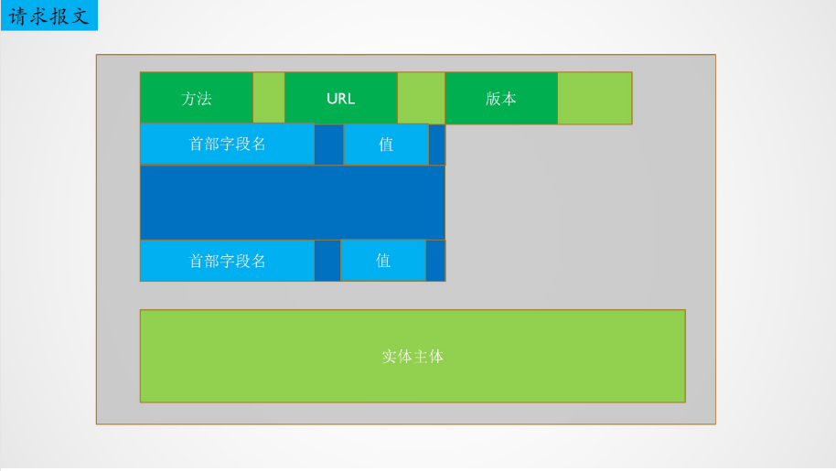
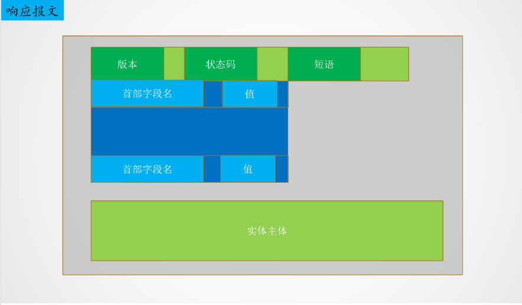

# `www` (world wide web)与`HTTP`协议

`HTTP`(HyperText Treansfer Protocol)协议就是**浏览器与服务器之间的应用层通信协议**。

`HTTP`协议的思想在传输文件与主机通信上也可以得到广泛的使用。

`HTTP`协议的思想是在**客户端与服务端之间的数据传输结束之后，就立即关闭连接。**当远端发起请求之后，服务端让一个线程处理这个请求，**在处理完请求之后，连接立即断开**，服务端不会保活。

`HTTP`协议的连接实际上可以认为是短连接，FTP中的控制连接是长连接，长连接从登入到登出这段时间内保持活性的，而FTP数据连接就是每次传输数据的时候建立，用完就断开，是短连接。

因此，我们在传输数据时，使用短连接，如果传输控制命令这种，还是要用长连接。

## 一、`HTTP` 协议的作用

+ `HTTP`协议定义了浏览器如何请求服务器，服务器如何相应浏览器(**请求与响应报文**)
+ `HTTP`协议规定了浏览器与服务器之间的**请求与响应报文的格式与规则**

  http（超文本传输协议）是一个基于请求与响应模式的、无状态的、应用层的协议，常基于TCP的连接方式，HTTP1.1版本中给出一种持续连接的机制，绝大多数的Web开发，都是构建在HTTP协议之上的Web应用。

## 二、`HTTP`协议的工作流程

`HTTP`协议采用C/S结构，基于`TCP`协议。`HTTP`协议的工作流程如下：

+ `HTTP`客户端发起到服务器的`TCP`连接，使用**默认端口80**，服务器和客户端各有一个套接字与之对应
+ **`HTTP`客户端经其套接字向服务器发送请求报文**。报文中包含要请求的对象。
+ `HTTP`服务器接受该报文，从服务器上检索对象，**在`HTTP`响应报文中封装该对象，并通过套接字传送。**
+ **`HTTP`服务器通知客户端断开`TCP`连接**
+ **`HTTP`客户端断开`TCP`连接**

> 连接，就是维护状态，在TCP连接，UDP连接中的socket套接字文件描述符，实际上就维护这这种状态信息。

## 三、`HTTP`协议的特点

+ `HTTP`是**无状态协议**，服务器不存储关于用户的状态信息。**浏览器用Cookie和数据库的方式跟踪用户的活动,服务器也有相关数据库。**。无状态是指协议**对于事务处理没有记忆能力**。缺少状态意味着如果后续处理需要前面的信息，则它必须重传，这样可能导致每次连接传送的数据量增大。另一方面，**在服务器不需要先前信息时它的应答就较快。**
+ `HTTP`**采用`TCP`作为运输层协议**，保证**数据的可靠传输**
+ `HTTP`**本身是无连接的**，无连接的含义是**限制每次连接只处理一个请求**。服务器处理完客户的请求，并收到客户的应答后，即断开连接。采用这种方式可以**节省传输时间**。
+ **`HTTP`服务器总是处于打开状态，有一个固定`IP`**
+ `HTTP`**可以使用非持久连接，也可以使用持久连接**
+ **支持客户/服务器模式。**

## 四、非持久连接与持久连接

`HTTP`既可以使用非持久连接，也可以使用持久连接。

### 1.非持久连接

对于非持久连接，每个网页元素对象的传输都需要单独建立一个`TCP`连接。

请求一个万维网文档的时间=文档传输时间+2 × `RTT`

### 2.持久连接

持久连接是指服务器在发送响应之后仍然保持这条连接，使得客户端与服务器可以继续在这条连接上传送后续的`HTTP`请求和接受文档。

持久连接分为：

+ **非流水线方式**：用户在收到前一个响应后才可以发出下一个请求，每个请求都会有一个`RTT`延迟
+ **流水线方式**：**默认使用流水线方式**，可以**连续发送请求，所有请求总共一个``RTT`延迟**

## 五、`HTTP`的报文结构

有两类`HTTP`报文：

+ **请求报文：**从客户端向服务器发送的请求报文
+ **响应报文：**从服务器到客户的回答

### 1.`HTTP`请求报文的结构

**常见的请求方法：**

| 请求方法 | 用途                               |
| -------- | ---------------------------------- |
| GET      | 请求获取数据                       |
| POST     | 上传表单(用户的身份验证信息)       |
| HEAD     | 开发时使用，仅查看请求数据是否存在 |
| PUT      | 上传数据给服务器存储               |
| DELETE   | 告知服务器删除指定数据             |

### 2.`HTTP`响应报文

`HTTP`响应报文常见的状态码与短语：

| 状态码 | 短语                       |
| ------ | -------------------------- |
| 200    | OK                         |
| 301    | Moved Permanently          |
| 400    | Bad Request                |
| 404    | Not Found                  |
| 505    | HTTP Version Not Supported |

## 六、代理服务器(WEB缓存器)

使用代理服务器：

+ **大大减少了客户请求的响应时间**
+ **减少了机构的接入链路到因特网的通信量**
+ **从整体上大大减少因特网上的WEB流量**，改善所有应用的性能

现在使用浏览器访问资源，通常就是访问web缓存器，和web缓存器建立TCP/UDP连接。

比较常见的web缓存器：CDN。

web缓存器会不定时更新资源的信息，web缓存器到资源服务器的请求报文的可以知道资源是否更新了，**在请求报文中增加与时间相关的字段。**

## 七、用户与服务器的交互—cookie

HTTP响应与请求报文中增加一个cookie首部行，在用户端由浏览器管理的cookie文件，服务器中有一个数据库记录cookie信息，比如淘宝中，服务端的数据库中记录了我们的浏览信息，进而给出推送服务。

**cookie的作用是将无状态的HTTP服务中添加了状态信息。**

## 八、HTTPS (SECURE HTTP)

**HTTP协议运行在TCP之上，所有传输的内容都是明文，HTTPS运行在SSL/TLS之上，SSL/TLS运行在TCP之上，所有传输的内容都经过加密的**。用的端口也不一样，**HTTP使用80端口，HTTPS使用443端口。**

HTTPS协议是由SSL+HTTP协议构建的可进行加密传输、身份认证的网络协议，较为安全。

