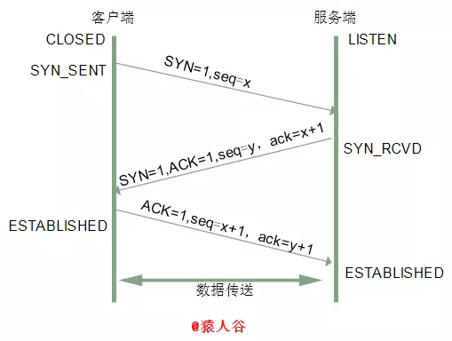

# `TCP`协议

为了解决C10K问题，我们通常使用线程池+epoll+nonblock。

## 一、`TCP`报文段结构

`TCP`传送的数据单元称为报文段。**一个`TCP`报文段分为`TCP`首部和`TCP`数据两部分。**整个`TCP`报文段作为`IP`数据报的数据部分封装在`IP`数据报中。

**`TCP`连接既可以用来运载数据，也可以用来建立连接、释放连接和应答。**

**==TCP报文段提供的可靠连接的含义是保证传输数据到达的顺序是正确的，但是由于传输层、网络层切分报文，内核缓冲空间的不足等原因，不能保证接收数据的长度是一致的，会发生拆包与粘包的问题，这需要在应用层来解决。==**

### 1.`TCP`报文段首部

`TCP`报文段首部的前20B是固定的，也是`TCP`报文段的首部最短长度。其格式如图：

####  (一)源端口和目的端口字段

源端口和目的端口字段是网络字节序的，其数据类型是短整型，16位。

#### (二)序号字段

序号字段占4B，`TCP`是面向字节流的，`TCP`连接传送的数据流中的每个字节都编上一个序号。**序号字段的值指的是本报文段所发送的数据的第一个字节的序号。**

#### (三)确认号字段

确认号字段占4B，是**期望收到对方的下一个报文段的数据的第一个字节的序号**。

**==若确认号为N，则表示到序号N-1为止的所有数据都已经正确收到。==**

#### (四)数据偏移字段(首部长度)

数据偏移字段即首部长度，占4位。数据偏移的单位是4B。

#### (五)六位标志位

常用的是`ACK`，`SYN`，`FIN`这3个。

**1.确认位`ACK`：(Accept  Check)**

只有在`ACK=1`时确认号有效。**`TCP`规定，在建立连接之后所有传送的报文段都必须把`ACK`置1。**

**2.同步位`SYN`：(Synchronize)**

同步**`SYN=1`表示这是一个连接请求或连接接受报文。**

`SYN=1,ACK=0`表明这是一个连接请求报文，`SYN=1,ACK=1`表明这是一个连接接受报文。

**3.终止位`FIN`：**

终止位用来释放一个连接。`FIN=1`表明此报文段的发送方的数据已经发送完毕，并要求释放连接。

#### (六)窗口字段

窗口字段占2B。**它指出现在允许对方发送的数据量，即==接受方数据缓存空间的大小，因此使用窗口值作为接受方让发送方设置其发送窗口的依据，单位为字节==。**

**TCP协议中还有超时的判断。**