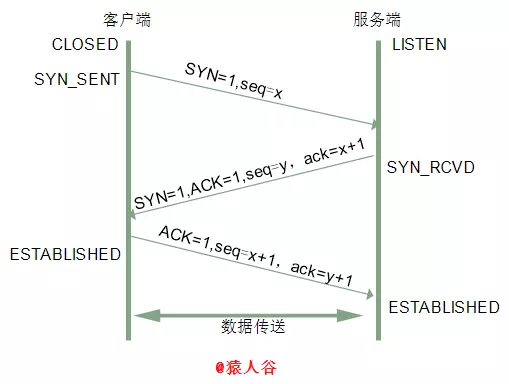
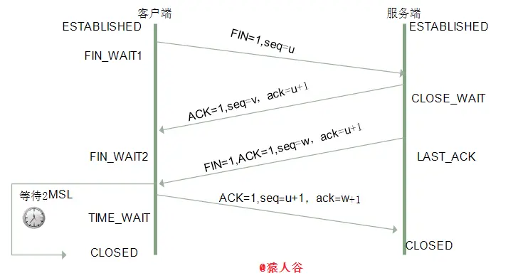

# TCP连接的建立与释放

## 一、TCP连接的建立

**TCP的连接的建立要经历三次握手。**

TCP连接建立要3次握手的目的：**需要三次握手才能确认双方的接收与发送能力是否正常。**

+ 第一次握手：客户端发送网络包，服务端收到了。
  这样服务端就能得出结论：**客户端的发送能力、服务端的接收能力是正常的。**
+ 第二次握手：服务端发包，客户端收到了。
  这样客户端就能得出结论：**服务端的接收、发送能力，客户端的接收、发送能力是正常的。**不过此时服务器并不能确认客户端的接收能力是否正常。
+ 第三次握手：客户端发包，服务端收到了。
  这样服务端就能得出结论：**客户端的接收、发送能力正常，服务器自己的发送、接收能力也正常。**

## 二、半连接队列与SYN攻击

### 1.半连接队列

服务器第一次收到客户端的 SYN 之后，就会处于 SYN_RCVD 状态，此时双方还没有完全建立其连接，服务器会把此种状态下请求连接放在一个队列里，我们把这种队列称之为半连接队列。

当然还有一个全连接队列，就是已经完成三次握手，建立起连接的就会放在全连接队列中。如果队列满了就有可能会出现丢包现象。

### 2.SYN攻击

**服务器端的资源分配是在第二次握手时分配的，而客户端的资源实在完成第三次握手时分配的。**所以服务器容易收到SYN洪泛攻击。

SYN攻击就是Client在短时间内伪造大量不存在的IP地址，并向Server不断地发送SYN包，Server则回复确认包，并等待Client确认，由于源地址不存在，因此Server需要不断重发直至超时，**这些伪造的SYN包将长时间占用未连接队列，导致正常的SYN请求因为队列满而被丢弃，从而引起网络拥塞甚至系统瘫痪。SYN 攻击是一种典型的 DoS/DDoS 攻击。**

检测 SYN 攻击非常的方便，**当你在服务器上看到大量的半连接状态时，特别是源IP地址是随机的，基本上可以断定这是一次SYN攻击**。在 Linux/Unix 上可以使用系统自带的 netstats 命令来检测 SYN 攻击。

**常见的防御 SYN 攻击的方法有如下几种：**

+ 缩短超时（SYN Timeout）时间
+ 增加最大半连接数
+ 过滤网关防护
+ SYN cookies技术

## 三、四次挥手

终止一个连接要经过四次挥手。**这由TCP的半关闭（half-close）造成的。所谓的半关闭，其实就是==TCP提供了连接的一端在结束它的发送后还能接收来自另一端数据的能力==。**

TCP 的连接的拆除需要发送四个包，因此称为四次挥手(Four-way handshake)，**==客户端或服务器均可主动发起挥手动作==。谁先发出终止，谁就是四次挥手中的客户机。**

**收到一个FIN只意味着在这一方向上没有数据流动。**客户端执行主动关闭并进入TIME_WAIT是正常的，服务端通常执行被动关闭，不会进入TIME_WAIT状态。

### 1.四次挥手的意义

关闭连接时，**当服务端收到FIN报文时，可能还有数据没有发送出去。只有等服务端所有的报文都发送完了，才能发送FIN报文，因此不能一起发送。故需要四次挥手。**

### 2.等待`2MSL`的意义

1. **为了保证客户端发送的最后一个ACK报文段能够到达服务器。因为这个ACK有可能丢失，从而导致处在LAST-ACK状态的服务器收不到对FIN-ACK的确认报文。服务器会超时重传这个FIN-ACK，接着客户端再重传一次确认，重新启动时间等待计时器。**最后客户端和服务器都能正常的关闭。假设客户端不等待2MSL，而是在发送完ACK之后直接释放关闭，一但这个ACK丢失的话，服务器就无法正常的进入关闭连接状态。
2. **使本连接持续的时间内所产生的所有报文段都从网络中消失，使下一个新的连接中不会出现这种旧的连接请求报文段。**

**==TIME_WAIT状态就是用来重发可能丢失的ACK报文==**。