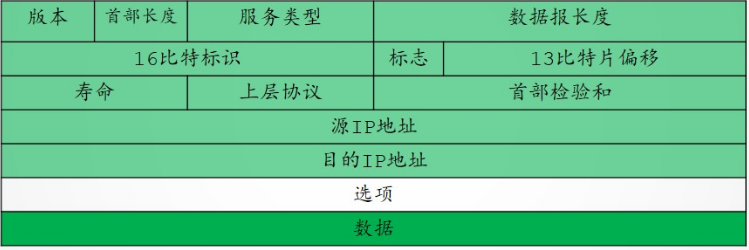

# IPV4分组数据报格式

## 一、IPV4分组的格式

一个IP分组由首部和数据两部分组成。**首部前一部分的长度固定，共20B**。后面是一些可选字段，长度可变，用来提供错误检测及安全等机制。

IP首部的部分重要字段的含义如下：

1. **版本：**占4位，指IP的版本，目前广泛使用的版本号为4.
2. **首部长度：**占4位，以4B为单位，最大值为60B(15×4B)。最常用的首部长度是20B，此时不使用任何可选字段。
3. **总长度：**占16位。指首部和数据部分的长度之和，单位为1B。因此数据报的最大长度是$2^{16}-1=65535B$。**以太网帧的最大传送单元$MTU$为$1500B$，因此当一个IP数据报封装成帧时，数据报的总长度(首部加数据)一定不能超过下面数据链路层的$MTU$值。**
4. **标识：**占16位。这是一个计数器，每产生一个数据报就加1,并赋给标识字段，**这不是序号，因为IP是无连接服务。**当一个数据报的长度超过网络的$MTU$时，必须分片，此时**每个数据报片都复制一次标识号，以便能正确重新装成原来的数据报。**
5. **标志：**占3位。标志字段的最低位为$MF$，$MF=1$表示后面还有分片，$MF=0$表示最后一个分片。标志字段中间的一位是$DF$，只有当$DF=0$时才允许分片。
6. **片偏移：**占13位。这指出较长的分组在分片之后，某片在原分组中的相对位置。片偏移以8B为偏移单位。
7. **生存时间(`TTL`)：**占8位。**数据报在网络中可通过的路由器数的最大值，表示分组在网络中的寿命，以确保分组不会永远在网络中循环。**路由器在转发分组之前，先把`TTL`减1。若`TTL`减为0,则将该分组丢弃。
8. **协议：**占8位。指出这个分组使用的是什么传输层协议，其中6表示TCP，17表示UDP。
9. **首部校验和：**占16位。IP数据报只校验首部。
10. **源地址字段：**占32位，源IP地址。
11. **目的地址字段：**占32位，目的IP地址。

