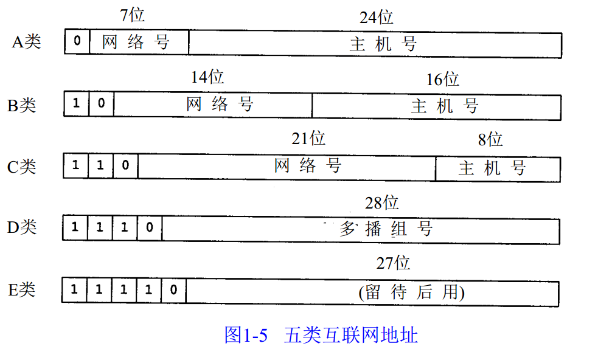

# IPV4地址编址规则

## 一、分类IP地址

IPV4地址是32位的标识符。传统的IP地址分为A,B,C,D,E五类。

不论哪类IP地址，**都是由网络号和主机号两部分组成**。其中网络号标志主机所连接到的网络，一个网络号在整个因特网范围内应当是唯一的。一台主机号在它前面的网络号所指明的网络范围内必须是唯一的。

**一些特殊的IP地址：**

1. 主机号全为0：表示本网络本身
2. 主机号全为1：表示本网络的广播地址
3. 127.0.0.0为Loopback Test环路自检地址，表示任意主机本身
4. 32位全为0,表示本网络上的本主机
5. 32位全为1,表示整个TCP/IP网络的广播地址，但是由于路由器隔离广播域，所以等效为本网络的广播地址。

各类IP地址的有效网络数与主机数注意一下就行。

## 二、网络地址转换(NAT)

网络地址转换(NAT)是指将专用网络地址转换为公用地址，从而对外隐藏内部管理的IP地址。NAT使得整个专用网只需要一个IP地址就可以与因特网连通，由于私网本地IP地址是可以重复用的，所以**NAT大大减少了IP地址的消耗。**同时，**NAT隐藏了内部网络结构，从而降低了内部网络受到攻击的风险。**

为了网络安全，划出了部分IP地址为私有地址。**私有地址只用于LAN，不用于WAN，==因此私有IP必须经过NAT把私有IP转换为Internet中合法的全球IP地址之后才可以用于Internet。==**

允许私有IP地址被LAN重复使用，这有效地解决了IP地址不足的问题。

私有IP地址网段如下：

A类：10.0.0.0~10.255.255.255

B类：172.16.0.0~172.31.255.255

C类：192.168.0.0~192.168.255.255

**互联网中的所有路由器，对目的地址是私有地址的数据报一律不进行转发。**这种采用私有IP地址的互联网络称为**专用互联网或者本地互联网**。**私有IP地址也称为可重用地址。**

NAT路由器至少有一个公网地址。在使用本地地址的主机和外界进行通信的时候，NAT路由器通过**NAT转换表将本地地址转换为公网地址，或者将公网地址转换为本地地址。**NAT转换表中存放着**{本地IP地址：端口}到{公网IP地址：端口}的映射**。通过这样的方式，可以使多个私有IP地址映射到同一个公网IP地址上。

## 三、子网划分与子网掩码

子网划分就是在主机号字段中再分出一个“子网号字段”。**划分子网是一个网络内部的事情，对外仍然表现为没有划分子网的网络。**

子网掩码与IP地址相与即可获得相应子网的网络地址。

## 四、`CIDR`—无分类域间路由选择

无分类域间路由选择是在变长子网掩码的基础上提出的一种消除传统A，B，C类网络的划分，并且可以在软件的支持下实现超网构造的一种IP地址的划分方法。

CIDR使用网络前缀代替子网的概念，因此，**IP地址的无分类两级编址为IP={网络前缀，主机号}。**CIDR还是用点分十进制的“斜线记法”。**同样，也有子网掩码。**

**网络前缀都相同的连续IP地址组成“CIDR地址块”。一个CIDR地址块可以表示很多地址，这种地址的聚合称为==路由聚合==，或称==构成超网==。**

使用CIDR，查路由表时使用**最长前缀匹配。**为了更加有效地查找最长前缀匹配，**通常将无分类编址的路由表组织为==二叉搜索树==，自上而下地按层次进行查找。**