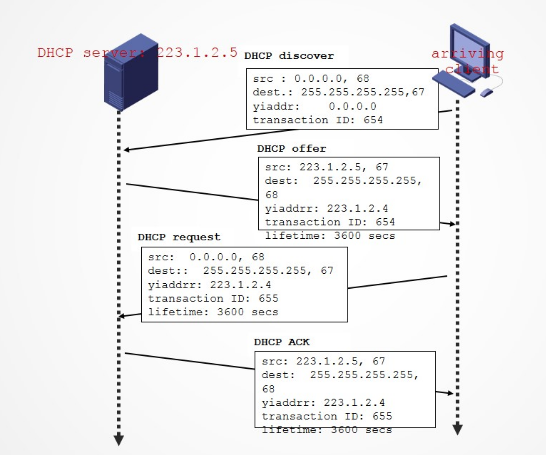

# IP地址与MAC地址

## 一、地址解析协议`ARP`

无论网络层使用什么协议，在实际网络的链路上传送数据帧时，最终必须使用硬件地址。

**地址解析协议`ARP`完成IP地址到MAC地址的映射。**

每台主机都设有一个**==`ARP`缓存，用来存放本局域网上各主机和路由器的IP地址到MAC地址的映射表，称为`ARP`表==(可以使用`arp`命令查看`ARP`表)**。使用`ARP`协议来动态维护此`ARP`表。

**`ARP`协议是工作在网络层的，因为它可以看到IP地址，同理NAT路由器工作在运输层，因为它可以看到端口。**

从IP地址到MAC地址的解析是自动进行的，用户并不知道这种地址解析过程。**只要主机或路由器和本网络上的另一个已知IP地址的主机或路由器进行通信，`ARP`就会自动地将这个IP地址解析为链路层所需要的硬件地址。**

## 二、动态主机配置协议`DHCP`

动态主机配置协议`DHCP`用于**给主机动态地分配IP地址**，它提供了即插即用的联网机制，这种机制允许一台计算机加入新的网络和获取IP地址而不用手工参与。**`DHCP`是应用层协议，它是基于`UDP`的。**

`DHCP`协议的工作流程如下：

1. `DHCP`客户机广播**`DHCP`发现**报文，试图找到`DHCP`服务器，以便获得一个IP地址。
2. `DHCP`服务器收到`DHCP`发现报文之后，**广播`DHCP`提供报文。**
3. `DHCP`客户机收到`DHCP`提供报文后，**广播`DHCP`请求报文。**
4. `DHCP`服务器**广播`DHCP`确认**消息。

**==`DHCP`客户机与服务器需要通过广播方式进行交互，原因是在`DHCP`执行期间，客户端与服务端都没有标识自己的IP地址，因此不可能通过单播的形式进行交互。==**

## 三、网际控制报文协议—`ICMP`

`ICMP`协议被主机和路由器用来沟通彼此的网络层信息。**`ICMP`协议位于`IP`协议之上，是`IP`层协议。**

`ICMP`协议的两类报文：**`ICMP`差错报告报文，`ICMP`询问报文。**

我们常用的`ping`命令就是`ICMP`的。