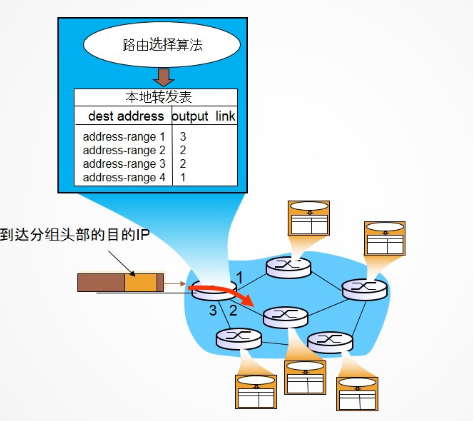

# 路由表(路由选择)与转发表(分组转发)

**==路由选择算法决定整个网络范围内的端到端的路径选择，转发表决定本地路由器内部转发的出口。==**

## 一、路由器

路由器是一种具有多个输入输出端口的专用计算机，**其任务是连接异构网络并完成路由转发**。

当源主机要向目标主机发送数据报时，路由器先检查源主机与目标主机是否连接在同一个网络上。如果**源主机和目标主机在同一个网络上，那么就直接交付。如果源主机和目标主机在不同的网络上，就必须通过路由器进行间接交付**。**因此，路由器隔离了广播域。**

从结构上看，**路由器由路由选择和分组转发两部分组成。**

路由器虽然是网络层设备，但是下三层的功能全都有。

## 二、路由选择

路由选择部分也称控制部分，其核心构件是**路由选择处理机**。

路由选择处理机的任务是**==根据所选定的路由选择协议构造出路由表，同时经常或定期地和其他相邻路由器交换路由信息而不断维护和更新路由表。==**

**当分组从发送方流向接受方时，网络层必须决定这些分组所采用的路由或者路径。 计算这些路径的算法被称为路由选择算法。**

## 三、分组转发

分组转发部分由三部分组成：**交换结构，一组输入端口，一组输出端口。**

每台路由器都有一个**转发表，路由器通过检查到达分组的首部字段的值来转发分组**。当**一个分组到达路由器的一条输入链路时，路由器必须将其移动到合适的输出链路转发出去**，这个移动的过程称为转发。

**交换结构是路由器中的关键部件**，它根据转发表对分组进行处理，将某个输入端口进入的分组从另一个合适的输出端口转发出去。**关键操作是转发表查询，转发及相关的队列管理和任务调度等。**

交换结构的三种类型：**内存式交换结构，总线式交换结构，纵横式交换结构(互联网络式)。**

**交换结构本身就是一个网络。**由于个人使用的主要还是内存式交换结构，因为结构简单，而且能够满足速度的需求，纵横式交换结构用于对速度要求特别高的场合。总线性能处于中间。

本地转发表根据分组的首部地址字段，实际上就是进行首部匹配来转发。

千兆路由器的含义：每个端口都可以达到千兆的性能。

路由器中的端口实际上是全双工的，分组在输入、输出端口都会排队，而排队时延是网络时延中最主要的时延。

