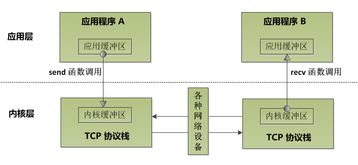

# 阻塞与非阻塞socket的IO分析

阻塞与非阻塞socket进行IO的区别就在于`send`和`recv`函数的行为。

## 一、`send()`和` recv()`操作的本质

`send()`系统调用**本质上不是向网络上发送数据，而是将应用层发送缓冲区的数据拷贝到内核缓冲区，==这个内核缓冲区的名字叫做`TCP`窗口==。**至于什么时候数据会从内核缓冲区中真正发送到网络中要根据`TCP/IP`协议栈的行为来确定。

`recv()`系统调用的**本质也不是从网络上收取数据，而是将内核缓冲区中的数据拷贝到应用程序的缓冲区中**，在拷贝完成之后会将内核缓冲区中该部分的数据移除。

过程如图所示：

在进行**网络通信时，发送的一方会将内核缓冲区的数据通过网络传输协议传输给接受方的内核缓冲区**。

## 二、阻塞socket与非阻塞socket区别

进行`send`时，如果接受方一直不接收，那么双方的内核缓冲区会很快填满：

+ 阻塞socket会等待内核缓冲区有空闲空间
+ 非阻塞socket不会等待，直接返回EWOULDBLOCK

进行`recv`时，如果发送方没有发送数据，接受方的内核缓冲区是空的：

+ 阻塞socket会等待有数据进入内核缓冲区
+ 非阻塞socket不会等待，直接返回EWOULDBLOCK

## 三、阻塞与非阻塞模式下`send()`与`recv()`函数的返回值

`send`和`recv`函数的各种返回值的意义：

| 返回值n    | 返回值含义                                                   |
| ---------- | ------------------------------------------------------------ |
| 大于0      | 成功发送或接收到n个字节                                      |
| 等于0      | 对端关闭连接                                                 |
| 小于0 (-1) | **出错、信号中断**或者**对端`TCP`窗口太小发不出去，或者自己的内核缓冲区没有数据(==后两种是非阻塞情况下的==)**。 |

**关于返回值为0,实际开发中不要让程序有机会去send 0字节数据，而实际上0字节数据，协议栈也不会允许其发送出去。**